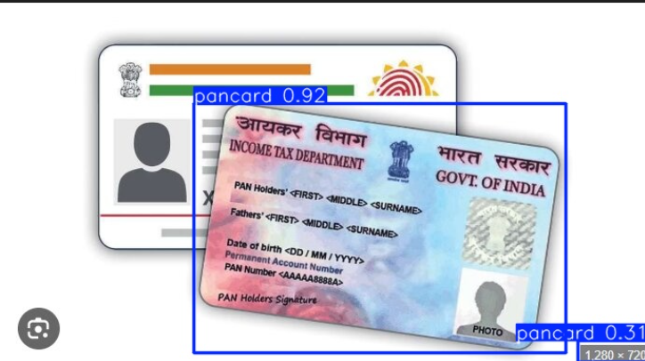

# PAN Card Detection using YOLO

## 📌 Project Overview

This project focuses on detecting PAN cards in images using a deep learning-based object detection model (YOLO).

The system identifies the presence and location of a PAN card by drawing bounding boxes around it.

---

## 🎯 Objective

* Detect PAN card in input images
* Localize PAN card using bounding boxes
* Handle real-world variations (lighting, background, angle)

---

## 🚀 Key Features

* YOLO-based object detection
* Accurate bounding box prediction
* Works on custom dataset
* Handles different image conditions

---

## 🧠 Model & Approach

* Model: YOLO (Ultralytics)
* Framework: PyTorch
* Task: Object Detection (PAN card localization)

---

## ⚙️ Workflow / Pipeline

1. Input image is provided
2. Image is passed to trained YOLO model
3. Model detects PAN card
4. Bounding box is drawn on detected region
5. Output image is saved in `outputs/`

---

## 🛠️ Tech Stack

* Python
* OpenCV
* Ultralytics YOLO
* PyTorch
* NumPy

---

## 📂 Project Structure

```id="panstruct2"
pan-card-detection/
│
├── sample_data/
├── outputs/
├── models/
│
├── train.py
├── test_model.py
├── requirements.txt
└── README.md
```

---

## ▶️ How to Run

### 1. Install dependencies

```bash id="panrun3"
pip install -r requirements.txt
```

### 2. Run detection

```bash id="panrun4"
python test_model.py
```

---

## 📊 Results

* Detects PAN cards in images
* Draws bounding boxes around detected regions
* Results available in `outputs/` folder

---

## 📸 Sample Output



---

## ⚠️ Limitations

* Performance depends on training data quality
* May struggle with low-quality or occluded images

---

## 🔮 Future Improvements

* Add automatic cropping of detected PAN card
* Integrate OCR to extract PAN details
* Deploy as API or web application

---

## 📌 Note

Dataset is not included in this repository due to size constraints.
Sample images are provided for demonstration.

---

## 👨‍💻 Author

Raviteja
